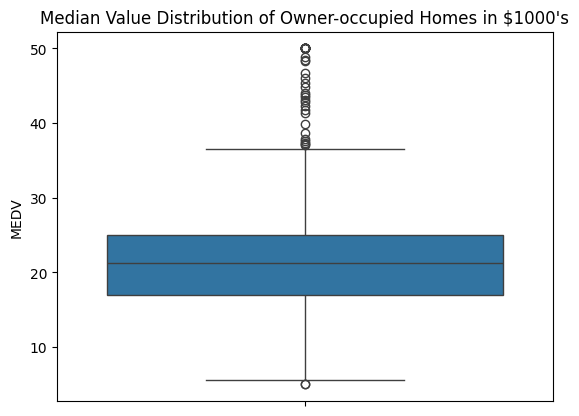
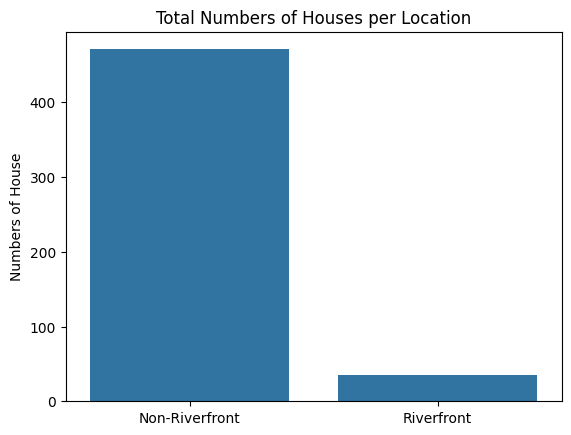

# Overview

You are a Data Scientist with a housing agency in Boston MA, you have been given access to a previous dataset on housing prices derived from the U.S. Census Service to present insights to higher management. Based on your experience in Statistics, what information can you provide them to help with making an informed decision?

Using the appropriate graphs and charts, generate basic statistics and visualizations that you think will be useful for the upper management to give them important insight given the question they are asking, in your graphs, include an explanation of each statistic. 

# Questions
Upper management will like to get some insight into the following.

- Is there a significant difference in the median value of houses bounded by the Charles river or not?

- Is there a difference in median values of houses of each proportion of owner-occupied units built before 1940?

- Can we conclude that there is no relationship between Nitric oxide concentrations and the proportion of non-retail business acres per town?

- What is the impact of an additional weighted distance to the five Boston employment centres on the median value of owner-occupied homes?

# Tools I Used
To give insight I use the following tools:
- **Python:** The backbone of my analysis, allowing me to analyze the data and find critical insights.I also used the following Python libraries:
    - **Pandas Library:** This was used to analyze the data.
    - **Matplotlib Library:** I visualized the data.
    - **Seaborn Library:** Helped me create more advanced visuals.
    - **Scipy Library:** For hypothesis testing.
    - **Statsmodels Library:** For regression analysis.
- **Jupyter Notebooks:** The tool I used to run my Python scripts which let me easily include my notes and analysis.
- **Git & GitHub:** Essential for version control and sharing my Python code and analysis, ensuring collaboration and project tracking.
- **ChatGPT:** Provides assistance when I encounter errors in my code.

# Data Preparation and Cleanup
This section discuss how i get the dataset, and what cleaning process i performed to the dataset.

First, Import all necessary libraries and load the dataset and remove unecessary column.
```python
import pandas as pd
import scipy.stats
import statsmodels.api as sm
import statsmodels.formula.api as ols
import seaborn as sns
import matplotlib.pyplot as plt

boston_df=pd.read_csv('https://cf-courses-data.s3.us.cloud-object-storage.appdomain.cloud/IBMDeveloperSkillsNetwork-ST0151EN-SkillsNetwork/labs/boston_housing.csv')
if 'Unnamed: 0' in boston_df.columns:
    boston_df.drop(labels= 'Unnamed: 0',axis= 'columns', inplace= True)
else:
    pass
boston_df.head(5)
```
The following describes the dataset variables:

- CRIM - per capita crime rate by town

- ZN - proportion of residential land zoned for lots over 25,000 sq.ft.

- INDUS - proportion of non-retail business acres per town.

- CHAS - Charles River dummy variable (1 if tract bounds river; 0 otherwise)

- NOX - nitric oxides concentration (parts per 10 million)

- RM - average number of rooms per dwelling

- AGE - proportion of owner-occupied units built prior to 1940

- DIS - weighted distances to five Boston employment centres

- RAD - index of accessibility to radial highways

- TAX - full-value property-tax rate per $10,000

- PTRATIO - pupil-teacher ratio by town

- LSTAT - % lower status of the population

- MEDV - Median value of owner-occupied homes in $1000's

# Analysis

## Descriptive Statistics and Visualizations
Jupyter Notebook: [5_Project_EDA](./5_Project_EDA.ipynb)

Generate the following and explain your findings:

- For the "Median value of owner-occupied homes" provide a boxplot
```python
sns.boxplot(
    data= boston_df['MEDV']
)
plt.title("Median Value Distribution of Owner-occupied Homes in $1000's")
plt.show()
```


- Provide a  bar plot for the Charles river variable
```python
CHAS_count = boston_df['CHAS'].value_counts().reset_index()
CHAS_count['CHAS'] = CHAS_count['CHAS'].replace({0:'Non-Riverfront',1:'Riverfront'})

sns.barplot(
    data= CHAS_count
    ,x= 'CHAS'
    ,y= 'count'
)
plt.title('Total Numbers of Houses per Location')
plt.xlabel("")
plt.ylabel("Numbers of House")
plt.show()
```


- Provide a boxplot for the MEDV variable vs the AGE variable. (Discretize the age variable into three groups of 35 years and younger, between 35 and 70 years and 70 years and older)
```python
df1 = boston_df.copy()
df1['Age_Group'] = df1['AGE'].apply(lambda x:'Younger Age' if x <= 35 else 'Middle Age' if x <= 70 else 'Older Age')
df1 = df1.sort_values(by='AGE',ascending= True)
sns.boxplot(
    data= df1
    ,x= 'Age_Group'
    ,y= 'MEDV'
)
plt.title('MEDV per Age Group')
plt.xlabel('')
```


- Provide a scatter plot to show the relationship between Nitric oxide concentrations and the proportion of non-retail business acres per town. What can you say about the relationship?
```python
sns.scatterplot(
    data= boston_df
    ,x= 'NOX'
    ,y= 'INDUS'
)
plt.title('Relationship between NOX and INDUS')
plt.xlabel('Nitric Oxides Concentrations (parts per 10Million)')
plt.ylabel('Proportion of Non-retail Business Acres per Town')
plt.show()
```


- Create a histogram for the pupil to teacher ratio variable
```python
sns.histplot(
    data= boston_df['PTRATIO']
)
plt.title('Total Count of Pupil-Teacher Ration in Town')
plt.xlabel('Pupil-Teacher Ratio')
plt.ylabel('Count')
```


## Hypothesis Testing

Jupyter Notebook: [6_Project_Tests](./6_Project_Tests.ipynb)

### Is there a significant difference in the median value of houses bounded by the Charles river or not?
We're checking first the variance and identify if it's equivalent using `scipy.stats.levene()` then we will perform hypothesis testing(T Test) using `scipy.stats.ttest_ind()`.

- **Hypothesis**
    + **Null Hypothesis** - There's no significant difference. `(U1 = U2)`
    + **Alternative Hypothesis** - There's siginificant difference. `(U1 != U2)`
- **Alpha**
    + Alpha = 0.05

- **Test Statistics**
```python
levene_result = scipy.stats.levene(
    boston_df[boston_df['CHAS'] == 0]['MEDV']
    ,boston_df[boston_df['CHAS'] == 1]['MEDV']
    ,center= 'median'
)
```
P-value is 0.0326 which is less than alpha(0.05) therefore we will reject the null hypothesis and set the equal_var to `False`.

```python
Ttest_result = scipy.stats.ttest_ind(
    boston_df[boston_df['CHAS'] == 0]['MEDV']
    ,boston_df[boston_df['CHAS'] == 1]['MEDV']
    ,equal_var= False
)
```
TtestResult(statistic=-3.113291312794837, pvalue=0.0035671700981375174, df=36.876408797611994)

- **Conclusion**
Since the P-value `0.00357` is less than alpha `0.05` we will reject the null hypothesis, There's significant difference in median home prices between homes that are near the Charles River and those that are not.


### Is there a difference in median values of houses of each proportion of owner-occupied units built before 1940?
Since the data provided is more than two we can use ANOVA  `scipy.stats.f_oneway()`

- **Hypothesis**
    + **Null Hypothesis** - There's no significant difference. `(U1 = U2 = U3 ....)`
    + **Alternative Hypothesis** - There's siginificant difference. `NOT(U1 = U2 = U3 ...)`
- **Alpha**
    + Alpha = 0.05

- **Test Statistics**
    + Hypothesis Testing using ANOVA
    ```python
    df1 = boston_df.copy()
    df1['AGE_Group'] = df1['AGE'].apply(lambda x:'Younger Age' if x <= 35 else 'Middle Age' if x <= 70 else 'Older Age')

    scipy.stats.f_oneway(
        df1[df1['AGE_Group'] == 'Younger Age']['MEDV']
        ,df1[df1['AGE_Group'] == 'Middle Age']['MEDV']
        ,df1[df1['AGE_Group'] == 'Older Age']['MEDV']
    )
    ```
    **Result**
    F_onewayResult(statistic=36.40764999196599, pvalue=1.7105011022702984e-15)

    + Regression Analysis
    ```python
    df1 = boston_df.copy()
    df1['AGE_Group'] = df1['AGE'].apply(lambda x:'Younger Age' if x <= 35 else 'Middle Age' if x <= 70 else 'Older Age')

    X = pd.get_dummies(df1['AGE_Group'], dtype= float)
    y = df1['MEDV']
    X = sm.add_constant(X)

    model = sm.OLS(y, X).fit()
    predictions = model.predict(X)

    model.summary()
    ```
    **Result**
    ```html
                                    OLS Regression Results                            
    ==============================================================================
    Dep. Variable:                   MEDV   R-squared:                       0.125
    Model:                            OLS   Adj. R-squared:                  0.120
    Method:                 Least Squares   F-statistic:                     23.94
    Date:                Fri, 09 May 2025   Prob (F-statistic):           1.69e-14
    Time:                        06:30:21   Log-Likelihood:                -1806.4
    No. Observations:                 506   AIC:                             3621.
    Df Residuals:                     502   BIC:                             3638.
    Df Model:                           3                                         
    Covariance Type:            nonrobust                                         
    ===============================================================================
                    coef    std err          t      P>|t|      [0.025      0.975]
    -------------------------------------------------------------------------------
    const        9.124e+13   1.47e+14      0.621      0.535   -1.98e+14     3.8e+14
    Middle Age  -9.124e+13   1.47e+14     -0.621      0.535    -3.8e+14    1.98e+14
    Older Age   -9.124e+13   1.47e+14     -0.621      0.535    -3.8e+14    1.98e+14
    Younger Age -9.124e+13   1.47e+14     -0.621      0.535    -3.8e+14    1.98e+14
    ==============================================================================
    Omnibus:                      161.218   Durbin-Watson:                   0.639
    Prob(Omnibus):                  0.000   Jarque-Bera (JB):              406.705
    Skew:                           1.613   Prob(JB):                     4.84e-89
    Kurtosis:                       5.981   Cond. No.                     9.21e+14
    ```
- **Conclusion**

Since the pvalue is less than the alpha `0.05` we will reject the null hypothesis and conclude that there's significant evidence that there's a difference between the age group.

### Can we conclude that there is no relationship between Nitric oxide concentrations and the proportion of non-retail business acres per town?
For this we're going to anayze the relationship between two continuous data, we can use pearson correlation `scipy.stats.pearsonr()` to identify the relationship.

- **Hypothesis**
    + **Null Hypothesis:** There's no correlation between two data.
    + **Alternative Hypothesis:** There's correlation between the two data.
- **Alpha**
    + Alpha = 0.05

- **Test Statistics**
    + Hypothesis Testing using Pearson Correlation Test
    ```python
    Pearson_result = scipy.stats.pearsonr(
    boston_df['NOX']
    ,boston_df['INDUS']
    )
    ```
    PearsonRResult(statistic=0.763651446920915, pvalue=7.913361061241532e-98)
    + Regression Analysis replacing Pearson Correlation Test
    ```python
    X = boston_df['NOX']
    y = boston_df['INDUS']
    X = sm.add_constant(X)

    model = sm.OLS(y, X).fit()
    predictions = model.predict(X)

    model.summary()
    ```
    Result
    ```html
                                    OLS Regression Results                            
    ==============================================================================
    Dep. Variable:                  INDUS   R-squared:                       0.583
    Model:                            OLS   Adj. R-squared:                  0.582
    Method:                 Least Squares   F-statistic:                     705.1
    Date:                Fri, 09 May 2025   Prob (F-statistic):           7.91e-98
    Time:                        05:55:22   Log-Likelihood:                -1470.5
    No. Observations:                 506   AIC:                             2945.
    Df Residuals:                     504   BIC:                             2954.
    Df Model:                           1                                         
    Covariance Type:            nonrobust                                         
    ==============================================================================
                    coef    std err          t      P>|t|      [0.025      0.975]
    ------------------------------------------------------------------------------
    const        -13.9414      0.965    -14.450      0.000     -15.837     -12.046
    NOX           45.2108      1.703     26.554      0.000      41.866      48.556
    ==============================================================================
    Omnibus:                       46.050   Durbin-Watson:                   0.272
    Prob(Omnibus):                  0.000   Jarque-Bera (JB):               67.622
    Skew:                           0.649   Prob(JB):                     2.07e-15
    Kurtosis:                       4.233   Cond. No.                         11.3
    ==============================================================================

    ```
- **Conclusion**

Since the p-value of 7.91e-98 is significantly lower than the alpha level of 0.05, we reject the null hypothesis. This suggests a positive correlation between the two datasets, as indicated by the Pearson correlation coefficient of 0.764


### What is the impact of an additional weighted distance to the five Boston employment centres on the median value of owner-occupied homes?

- **Hypothesis**
    + **Null Hypothesis:** DIS have no impact to MEDV.
    + **Alternative Hypothesis:** DIS have impact to MEDV.
- **Alpha**
    + Alpha = 0.05

- **Test Statistics**
    + Regression Analysis
    ```python
    X = boston_df['DIS']
    y = boston_df['MEDV']
    X = sm.add_constant(X)

    model = sm.OLS(y, X).fit()
    predictions = model.predict(X)

    model.summary()
    ```
    **Result**
    ```html
                                OLS Regression Results                            
    ==============================================================================
    Dep. Variable:                   MEDV   R-squared:                       0.062
    Model:                            OLS   Adj. R-squared:                  0.061
    Method:                 Least Squares   F-statistic:                     33.58
    Date:                Fri, 09 May 2025   Prob (F-statistic):           1.21e-08
    Time:                        06:47:57   Log-Likelihood:                -1823.9
    No. Observations:                 506   AIC:                             3652.
    Df Residuals:                     504   BIC:                             3660.
    Df Model:                           1                                         
    Covariance Type:            nonrobust                                         
    ==============================================================================
                    coef    std err          t      P>|t|      [0.025      0.975]
    ------------------------------------------------------------------------------
    const         18.3901      0.817     22.499      0.000      16.784      19.996
    DIS            1.0916      0.188      5.795      0.000       0.722       1.462
    ==============================================================================
    Omnibus:                      139.779   Durbin-Watson:                   0.570
    Prob(Omnibus):                  0.000   Jarque-Bera (JB):              305.104
    Skew:                           1.466   Prob(JB):                     5.59e-67
    Kurtosis:                       5.424   Cond. No.                         9.32
    ==============================================================================
    ```
- **Conclusion**
Since the pvalue is less than alpha 0.05 we will reject the null hypothesis and conclude that there's a significant evidence that the additional weighted distance to the five Boston employment centres affect the value of owner-occupied homes.